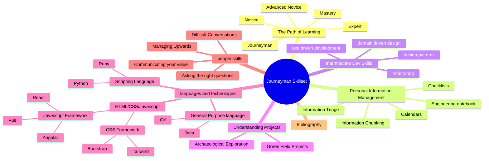

# Developer Meta Skills / Mid Level Developer Book

```mermaid
mindmap
    root((Journeyman Skillset))
      The Path of Learning
         Novice
         Advanced Novice
         Journeyman
         Expert
         Mastery
      Personal Information Management
        Engineering notebook
        Information Triage
        Calendars
        Checklists
        Information Chunking
      Intermediate Dev Skills
  	    refactoring
  	    domain driven design
  	    test driven development
  	    design patterns
      Understanding Projects
        Green Field Projects
        Archaeological Exploration
      languages and technologies
        General Purpose language
          Java
          C#
        Scripting Language
          Python
          Ruby
        HTML/CSS/Javascript
           CSS Framework
             Bootstrap
             Tailwind
           Javascript Framework
             Angular
             React
             Vue
      people skills
      	Communicating your value
      	Asking the right questions
      	Managing Upwards
      	Difficult Conversations
      Bibliography
```

